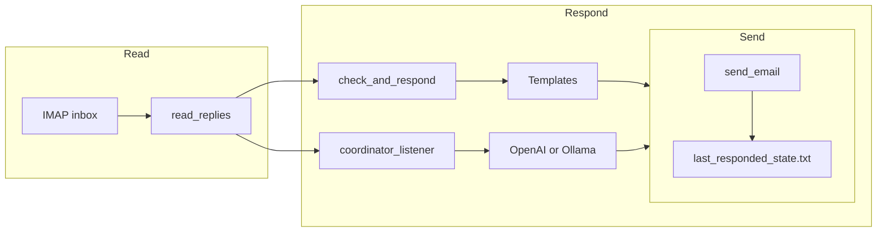

# Coordinator Email: Review and Test Plan (Wrong-Reply Focus)

You're receiving emails but replies are wrong (tone, template, or don't address what you said). This plan reviews the reply pipeline, identifies causes, and adds a concrete test plan.

---

## 1. How replies are produced (two paths)

- **Path A – Templates** ([check_and_respond.py](scripts/coordinator-email/check_and_respond.py)): Runs on a schedule or manually. Picks one of 4 templates from subject+body keywords (weekly/board, thanks, priority, default “we got your message”). No Coordinator persona; fixed wording.
- **Path B – Coordinator LLM** ([coordinator_listener.py](scripts/coordinator-email/coordinator_listener.py)): Runs while Cursor/terminal is open. Sends subject+body to OpenAI or Ollama with [coordinator-instructions.md](docs/agents/coordinator-instructions.md). Reply is free-form from the model.

If both run, they share the same state file: whoever responds first “wins” and the other skips (same `message_id`). So you can get either a template reply or an LLM reply depending on which process runs first and whether the listener is running.

---

## 2. Review: Why replies might be “wrong”

| Cause                   | Where                                                                                      | What to check                                                                                                                                                                                                               |
| ----------------------- | ------------------------------------------------------------------------------------------ | --------------------------------------------------------------------------------------------------------------------------------------------------------------------------------------------------------------------------- |
| **Wrong path**          | Which script ran (schedule vs listener)                                                    | If listener is off, only templates run. If both run, first responder wins; the other never replies.                                                                                                                         |
| **Wrong template**      | [check_and_respond.py](scripts/coordinator-email/check_and_respond.py) `choose_response()` | Matching is keyword/regex on “subject + body” lowercased. One match wins (order: weekly board → thanks → priority → default). Wording that doesn’t match (e.g. “weekly summary” without “board”/“digest”) falls to default. |
| **Generic default**     | Same                                                                                       | Default is “We got your message. We'll follow up…” — doesn’t address content.                                                                                                                                               |
| **LLM context**         | [coordinator_listener.py](scripts/coordinator-email/coordinator_listener.py)               | LLM gets full subject + body but no thread history, no explicit “user asked X, address X.” Prompt says “Reply as Coordinator” and “assign work or delegate” but doesn’t force “answer the user’s question first.”           |
| **LLM model/quality**   | Ollama (e.g. llama3.2) vs OpenAI                                                           | Local model may be more generic or miss nuance; timeout (e.g. 300s) can cause silent skip on slow runs.                                                                                                                     |
| **Single-message read** | [read_replies.py](scripts/coordinator-email/read_replies.py)                               | Returns only the single “latest” matching message (Re: + OutOfRouteBuddy in subject, last 50 messages). If you have multiple threads, “latest” is by IMAP order, not necessarily the thread you care about.                 |

**Bug (unrelated to wrong content but can cause crashes):** When the inbox is empty, [read_replies.py](scripts/coordinator-email/read_replies.py) returns `None, None, None` (3 values) but callers unpack 4 values (`subject, body, date, message_id`) → `ValueError`. Fix: return `None, None, None, None` at line 91.

---

## 3. Test plan

### 3.1 Unit (no IMAP/SMTP)

- **Template selection**  
  - For `check_and_respond.choose_response(subject, body)` with fixed strings, assert:  
    - “weekly board digest” / “weekly meeting summary” → weekly digest template.  
    - “thanks” / “got it” → thanks template.  
    - “prioritize reports” → priority template.  
    - “when is the next release?” (no keyword) → default template.
  - Add a case that you care about (e.g. “change the day of the digest”) and decide expected template or that it should stay default until we add a new template.
- **State**  
  - `load_last_responded_id()` / `save_responded_id(message_id)` with a temp file: save then load, assert id matches; assert “already responded” when `message_id == last_id`.
- **read_replies return shape**  
  - After fixing the empty-inbox return: mock or fixture that returns 4 values; ensure all callers (check_and_respond, coordinator_listener, agent_email) unpack without error.

### 3.2 Integration (optional .env; avoid real send when possible)

- **Read path**  
  - With real .env: run `agent_email.py read` (or `read_replies.py --json`), assert JSON has `subject`, `body`, `date`, `message_id` when there is a matching reply, and `found: false` or empty when not.  
  - No .env: skip or use a fixture that mocks `read_replies()`.
- **Send path**  
  - Prefer not to send real mail from tests. Option A: add a “dry run” or mock in `send_email.send()` that only logs and returns. Option B: run `send_email` against a test account and assert no exception (manual or in a separate, guarded CI step).
- **check_and_respond --dry-run**  
  - Run with a known inbox state (or mock `read_replies` to return a fixed subject/body). Assert `auto_reply_draft.txt` contains the expected subject and body for that template.

### 3.3 End-to-end (manual, scripted scenarios)

- **Scenario 1: Template reply**  
  - Stop the listener. Send a test reply that clearly matches one template (e.g. “Thanks, that works”). Run `check_and_respond.py` (or schedule it once). Assert you receive the thanks template and that `last_responded_state.txt` is updated.
- **Scenario 2: Coordinator (LLM) reply**  
  - Don’t run `check_and_respond` on a schedule. Start `coordinator_listener.py` (Ollama or OpenAI). Send a reply that asks for something specific (e.g. “Prioritize the export feature and tell me the plan”). Assert you get a reply that (a) references your ask and (b) is in Coordinator tone (assigns/delegates or says HITL will follow up). If using Ollama, confirm no timeout (check listener logs).
- **Scenario 3: “Wrong” reply**  
  - Reproduce a case where you got the wrong reply: note which path was running (listener vs scheduled check_and_respond), what you wrote, and what you received. Turn that into a regression test: e.g. “For body X we expect a reply that contains Y” or “we expect the weekly digest template, not the default.”

### 3.4 Diagnostics to add (recommended)

- **Log which path replied**  
  - In `check_and_respond.py`: log “Responded with template: weekly_digest|thanks|priority|default.”  
  - In `coordinator_listener.py`: log “Responded as Coordinator (Ollama|OpenAI).”  
  This helps confirm whether the “wrong” reply came from a template or the LLM.
- **Log template chosen**  
  - In `check_and_respond.py`: log the (subject, body) snippet or a hash and the chosen template key.  
  Makes it easy to see why a given message got the default or a different template.

---

## 4. Recommended order of work

1. **Fix** [read_replies.py](scripts/coordinator-email/read_replies.py) empty-inbox return to 4 values.
2. **Add unit tests** for `choose_response()` and state; add one or two “wrong reply” cases you care about (expected template or expected content).
3. **Add dry-run or mock for send** so integration tests can run without sending real email.
4. **Add diagnostics** (which path replied; which template) and run one E2E scenario (template + one LLM scenario) to confirm behavior and capture a baseline.
5. **Tighten reply quality:**
  - If the problem is **templates**: extend `choose_response()` with more keywords or a new template for the phrasing you use, and add tests.  
  - If the problem is **LLM**: adjust the Coordinator prompt to “First briefly acknowledge the user’s question or request; then assign work or delegate,” and add an E2E test that sends a specific ask and asserts the reply contains an acknowledgment.

---

## 5. Files to touch (summary)

| File                                                                                                          | Change                                                                            |
| ------------------------------------------------------------------------------------------------------------- | --------------------------------------------------------------------------------- |
| [scripts/coordinator-email/read_replies.py](scripts/coordinator-email/read_replies.py)                        | Return `None, None, None, None` when `msg_ids` is empty.                          |
| [scripts/coordinator-email/check_and_respond.py](scripts/coordinator-email/check_and_respond.py)              | Add unit-testable `choose_response()` (already is); add logging (which template). |
| [scripts/coordinator-email/coordinator_listener.py](scripts/coordinator-email/coordinator_listener.py)        | Add logging (Coordinator reply sent via Ollama/OpenAI).                           |
| New: `scripts/coordinator-email/test_*.py` (or repo test dir)                                                 | Unit tests for templates and state; optional integration for read/dry-run.        |
| [docs/agents/coordinator-instructions.md](docs/agents/coordinator-instructions.md) or listener prompt in code | Optional: clarify “acknowledge user’s request first, then assign/delegate.”       |

This gives you a clear review (why replies are wrong), a test plan (unit, integration, E2E, diagnostics), and a small set of code changes to fix a bug and improve reply behavior and observability.