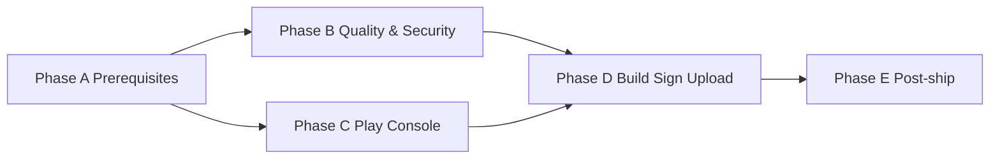

# Full Plan Prompt: Bring OutOfRouteBuddy to Google Play Shipping Level

**Use this document as the master prompt or plan** to bring the OutOfRouteBuddy Android app to a state where it can be submitted to the Google Play Store. Execute each section in order; check off items as done. References point to existing docs in the repo.

---

## Context

- **App:** OutOfRouteBuddy (trip tracking, out-of-route miles, calendar/stats, crash recovery).
- **Current version:** `versionCode` 2, `versionName` "1.0.2" (source of truth: `app/build.gradle.kts`).
- **Build:** minSdk 24, targetSdk 34, Java 17, Gradle (see `docs/DEPLOYMENT.md`). Release has `isMinifyEnabled = true`, `isShrinkResources = true`; lint `abortOnError = true`.
- **CI:** `.github/workflows/android-tests.yml` runs unit tests (`jacocoSuiteTestsOnly`), lint (`lintDebug`), debug build, and instrumented tests on macOS.

### Quick ship (repeat releases)

When Phase A and Phase C are already done (keystore exists, Play listing exists), use this minimal sequence:

1. Bump `versionCode` and `versionName` in [app/build.gradle.kts](app/build.gradle.kts).
2. Update [CHANGELOG.md](CHANGELOG.md) with a dated release section.
3. Run `.\gradlew.bat :app:testDebugUnitTest` (Windows) or `./gradlew :app:testDebugUnitTest` (Unix) and `.\gradlew.bat :app:lintDebug` (or `./gradlew :app:lintDebug`).
4. Run `.\gradlew.bat clean assembleRelease` (or `./gradlew clean assembleRelease`) and sign the artifact.
5. Upload to Play Console → Internal testing (or Production).
6. Add release notes and start or continue staged rollout (e.g. 20% → 50% → 100%).

### Execution order

- **Phase A — Prerequisites (do first):** Keystore, Application ID decision, privacy policy URL. Blocks nothing else but should be done before first release build.
- **Phase B — Quality and security (before upload):** Version/changelog, unit tests, lint, instrumented tests, release build smoke, manual QA, security audit, gaps decision.
- **Phase C — Play Console (parallel where possible):** Create app (if new), store listing, content rating, target audience, pricing, Data safety form. Can start once privacy policy URL exists.
- **Phase D — Build, sign, upload:** Clean, assembleRelease, sign, upload to Internal testing, then production track with release notes and staged rollout.
- **Phase E — Post-ship:** Monitoring, rollback plan, first-patch plan.

Phases B and C can overlap (e.g. Data safety after privacy policy; store listing assets in parallel with QA).



---

## 1. Store and legal prerequisites

### 1.1 Privacy policy and Data safety

- [ ] **Privacy policy**
  - **Sub-steps:**
    1. Draft policy text using the **Analytics and Crashlytics event table** from [docs/security/SECURITY_NOTES.md](docs/security/SECURITY_NOTES.md) §10 (events: `app_open`, `low_memory_warning`, `critical_memory_trim`, `moderate_memory_trim`, `performance_metrics`, `potential_memory_leak`, `trip_ended`/`trip_paused`/`trip_resumed`; Crashlytics for crashes/non-fatal; no PII).
    2. Add standard clauses: data stored on-device (trip history, preferences); no sale of data; Firebase usage (crash/diagnostics) per Play Data safety.
    3. Host at a stable public URL (e.g. GitHub Pages, project site, or Play Console–hosted).
    4. Add that URL in Play Console under Store settings > Privacy policy.
  - **Acceptance criteria:** URL is public and linked in Play Console; policy text matches SECURITY_NOTES §10 and store requirements.

- [ ] **In-app disclosure**
  - **Sub-steps:**
    1. If required (store or jurisdiction), add a "Privacy policy" link that opens the policy URL (e.g. in [app/src/main/java/com/example/outofroutebuddy/presentation/ui/settings/SettingsFragment.kt](app/src/main/java/com/example/outofroutebuddy/presentation/ui/settings/SettingsFragment.kt): in the About dialog or a new preference that launches an Intent with the URL).
    2. Use the same URL as in Play Console.
  - **Acceptance criteria:** User can open the privacy policy from within the app when required.

- [ ] **Play Console — Data safety**
  - Declare: data stored **on-device** (trip history, preferences).
  - If using Firebase: declare **crash data** and **diagnostics**; state that no PII is sent (per SECURITY_NOTES §10).

**Ref:** `docs/STORE_CHECKLIST.md` §§1–2, `docs/security/SECURITY_NOTES.md` §10.

### 1.2 Application ID (optional but recommended for production)

- [ ] Decide whether to keep `applicationId = "com.example.outofroutebuddy"` or change to a production ID (e.g. `com.yourcompany.outofroutebuddy`). Changing it after first release is not supported without a new app listing.
- [ ] If changing: update `applicationId` in [app/build.gradle.kts](app/build.gradle.kts) (defaultConfig, line 23), ensure Firebase/Google config (e.g. `google-services.json`) matches, and document in DEPLOYMENT.md.
- **Note:** Changing applicationId requires a new Firebase/Google app config and cannot be undone for an existing Play listing.

**Ref:** [app/build.gradle.kts](app/build.gradle.kts) defaultConfig.applicationId.

---

## 2. Release keystore and signing

Choose one path; document the chosen method in [docs/DEPLOYMENT.md](docs/DEPLOYMENT.md).

**Path 1 — Android Studio (no secrets in repo):**

- [ ] Create keystore via keytool:
  ```bash
  keytool -genkey -v -keystore outofroutebuddy.keystore -alias outofroutebuddy -keyalg RSA -keysize 2048 -validity 10000
  ```
- [ ] Store the keystore file and passwords in a **secure place** (encrypted backup or secret manager). **Do not commit** the keystore to the repo.
- [ ] In Android Studio: **Build > Generate Signed Bundle / APK**; select release; choose keystore; document the process in DEPLOYMENT.md (e.g. "Release signing is done via Android Studio Generate Signed Bundle/APK using the keystore stored at [location]. Passwords are in [secure store].").

**Path 2 — Gradle (CI or scripted builds):**

- [ ] Add `signingConfigs { release { ... } }` in [app/build.gradle.kts](app/build.gradle.kts) reading keystore path and passwords from environment variables or `local.properties` (ensure `local.properties` is in `.gitignore`).
- [ ] Document in DEPLOYMENT.md: where the keystore is stored, who has access, and how to set the env vars for local/CI.
- **Note:** DEPLOYMENT.md may show `jarsigner` + `zipalign`; align that with the chosen path (Studio vs Gradle vs command-line).

**Acceptance criteria:** Release build is signable without committing secrets; DEPLOYMENT.md states where the keystore lives and how to sign.

**Ref:** `docs/STORE_CHECKLIST.md` §3, `docs/DEPLOYMENT.md` (APK Signing).

---

## 3. Version and changelog

- [ ] **Version:** In [app/build.gradle.kts](app/build.gradle.kts), `defaultConfig` block (lines 26–27): set `versionCode` (integer, must increase each release) and `versionName` (user-visible string, e.g. `"1.0.3"`).
- [ ] **CHANGELOG:** In [CHANGELOG.md](CHANGELOG.md), add a new `## [1.0.3] - YYYY-MM-DD` section; move or copy items from `[Unreleased]` into this release; keep a short "Known limitations" or "Deferred" line if relevant (e.g. ThemeScreenshotTest deferred).

**Acceptance criteria:** versionCode/versionName match the release; CHANGELOG has a dated section for this release.

**Ref:** `docs/STORE_CHECKLIST.md` §4, `CHANGELOG.md`.

---

## 4. Quality gates (must pass before upload)

### 4.1 Unit tests

- [ ] **Command (Windows):** `.\gradlew.bat :app:testDebugUnitTest`
- [ ] **Command (Unix):** `./gradlew :app:testDebugUnitTest`
- [ ] **Artifact:** `app/build/reports/tests/testDebugUnitTest/index.html`
- [ ] If any test is deferred: add `@Ignore("reason")` and update [docs/qa/FAILING_OR_IGNORED_TESTS.md](docs/qa/FAILING_OR_IGNORED_TESTS.md).
- [ ] Optional: Run `.\gradlew.bat jacocoSuite` (or `./gradlew jacocoSuite`) for coverage report; see `docs/qa/JACOCO_SUITE.md`. CI uses `jacocoSuiteTestsOnly`.

**Acceptance criteria:** All non-ignored tests pass; ignored tests documented.

### 4.2 Lint

- [ ] **Command (Windows):** `.\gradlew.bat :app:lintDebug`
- [ ] **Command (Unix):** `./gradlew :app:lintDebug`
- [ ] **Artifact:** `app/build/reports/lint-results-debug.html`
- [ ] **Zero errors.** Fix or suppress all lint errors (abortOnError is true in [app/build.gradle.kts](app/build.gradle.kts) lint block). Warnings: fix critical ones; document or suppress others.

**Acceptance criteria:** Zero errors (abortOnError is true in app/build.gradle.kts lint block).

### 4.3 Instrumented tests (pre-release)

- [ ] **Command (Windows):** `.\gradlew.bat connectedDebugAndroidTest`
- [ ] **Command (Unix):** `./gradlew connectedDebugAndroidTest` (device/emulator must be connected).
- [ ] Fix or quarantine any failing instrumented tests; document in [docs/qa/FAILING_OR_IGNORED_TESTS.md](docs/qa/FAILING_OR_IGNORED_TESTS.md) if deferred.

**Acceptance criteria:** No unacknowledged failures; any deferred tests documented in FAILING_OR_IGNORED_TESTS.md.

### 4.4 Release build and ProGuard

- [ ] **Commands (Windows):** `.\gradlew.bat clean assembleRelease`
- [ ] **Commands (Unix):** `./gradlew clean assembleRelease`
- [ ] **Output:** `app/build/outputs/apk/release/`
- [ ] **ProGuard/R8:** [app/proguard-rules.pro](app/proguard-rules.pro) already contains Hilt, Room, Firebase, coroutines, and app-specific keep rules. If runtime crashes occur on release build, add keep rules and re-test.
- [ ] Install and smoke-test (launch, start trip, end trip) on a device or emulator.

**Acceptance criteria:** Release APK builds; install and smoke-test on device or emulator.

**Ref:** `docs/qa/TEST_STRATEGY.md`, `docs/DEPLOYMENT.md` (Build Commands), `docs/GRADLE_9_MIGRATION_NOTES.md` (Release minification).

---

## 5. Manual testing checklist (before first upload)

Complete the following **numbered matrix (M1–M15)** before first production upload. Merge of core flow and [docs/qa/BUBBLE_NOTIFICATION_100_RELEASE_GATE.md](docs/qa/BUBBLE_NOTIFICATION_100_RELEASE_GATE.md) manual matrix.

| # | Step | Sign-off |
|---|------|----------|
| **M1** | Install debug or signed release on device (e.g. `.\gradlew.bat :app:installDebug` or install signed release). | |
| **M2** | Core: Start trip. | |
| **M3** | Core: Add miles (GPS or manual), end trip. | |
| **M4** | Core: View history; open calendar/stats; change settings. | |
| **M5** | Trip recovery: Force-stop app during active trip; reopen; confirm recovery dialog and continue vs start-new behavior. | |
| **M6** | Notification: With active trip, confirm pull-down text shows "Trip in progress". | |
| **M7** | End-near: Let detector trigger; confirm pull-down text becomes "Trip ending"; tap notification opens app and end-trip confirmation path. | |
| **M8** | Continue path: Choose "No, continue trip" from overlay; confirm pull-down returns to "Trip in progress"; no duplicate/stuck "Trip ending". | |
| **M9** | Re-alert: After continue cooldown, confirm detector can re-alert while trip remains active. | |
| **M10** | Overlay denied: Disable overlay permission; confirm fallback notification appears and opens app to end-trip confirmation. | |
| **M11** | Theme switch: With active trip, switch dark/light modes repeatedly; confirm no crash and notification text remains state-correct. | |
| **M12** | End/clear: End trip and clear; confirm services stop cleanly and no overlay/bubble remains. | |
| **M13** | Location permission: Deny → graceful degradation (no crash); grant → trip start works. | |
| **M14** | Data management: Export if present; clear all data and confirm state resets. | |
| **M15** | No AndroidRuntime crashes during the above (optional: `adb logcat -d -v time AndroidRuntime:E *:S`). | |

**Acceptance criteria:** All manual steps M1–M15 completed and signed off before first production upload.

**Ref:** `docs/DEPLOYMENT.md` (Manual Testing Checklist), `docs/qa/BUBBLE_NOTIFICATION_100_RELEASE_GATE.md`.

---

## 6. Security and compliance (shipping-level)

- [ ] **Secrets:** Confirm [app/google-services.json](app/google-services.json) (if present) is documented in [docs/security/SECURITY_NOTES.md](docs/security/SECURITY_NOTES.md) §1; API key restricted in GCP.
- [ ] **PII in logs:** Search codebase for `Log.`/`AppLogger` in trip save, recovery, and sync paths (e.g. TripInputViewModel.endTrip, TripStatePersistence, TripTrackingService); ensure no coordinates, trip IDs, or user-identifying content in log messages.
- [ ] **Backup:** [app/src/main/AndroidManifest.xml](app/src/main/AndroidManifest.xml) has `android:allowBackup="true"` and `android:fullBackupContent="@xml/backup_rules"`; confirm [app/src/main/res/xml/backup_rules.xml](app/src/main/res/xml/backup_rules.xml) excludes database and sharedpref (per SECURITY_NOTES §9).
- [ ] **Dependencies:** Run `./gradlew dependencyUpdates` (if Ben Manes plugin is added) or OWASP Dependency-Check; document date and result in SECURITY_NOTES §11 or [docs/security/LAST_DEPENDENCY_AUDIT.md](docs/security/LAST_DEPENDENCY_AUDIT.md).

**Acceptance criteria:** No PII in logs in hot paths; backup rules verified; dependency audit run and documented.

**Ref:** `docs/security/SECURITY_NOTES.md`, [docs/technical/BACKUP_AND_RESTORE.md](docs/technical/BACKUP_AND_RESTORE.md).

---

## 7. Known gaps (fix or explicitly defer)

From `docs/CRUCIAL_IMPROVEMENTS_TODO.md` and related docs; for each item decide **fix before ship** or **defer** and document.

| Gap | Option A — Fix before ship | Option B — Defer |
|-----|----------------------------|------------------|
| **OfflineDataManager** load/save (log-only) | Implement `loadOfflineStorage`/`saveOfflineStorage` in OfflineDataManager. | Document "offline persistence across restarts is limited" in CHANGELOG "Known limitations" or STORE_CHECKLIST / CRUCIAL_IMPROVEMENTS_TODO. |
| **Location jump detection** (TripStateManager) | Implement jump detection and handling. | Document as future work in CHANGELOG or "Deferred for 1.0.3" in STORE_CHECKLIST. |
| **Trip history → TripDetailsFragment** | Wire adapter click to TripDetailsFragment (navigation from history list to detail). | Document in CHANGELOG "Known limitations" or CRUCIAL §4. |
| **Ignored/deferred tests** (ThemeScreenshotTest, OfflineDataManagerPersistenceTest, LocationValidationServiceTest, etc.) | Fix or remove tests so none are ignored. | Add to [docs/qa/FAILING_OR_IGNORED_TESTS.md](docs/qa/FAILING_OR_IGNORED_TESTS.md); add short note in release notes or CHANGELOG "Known limitations". |
| **Gradle 9** deprecation warnings | Run `--warning-mode all`, fix or document in GRADLE_9_MIGRATION_NOTES.md. | Document "Gradle 9 migration deferred" in CHANGELOG or GRADLE_9_MIGRATION_NOTES; not blocking for first ship. |

**Acceptance criteria:** Each gap has a written decision (fix vs defer) and, if deferred, a short note in CHANGELOG or release notes.

**Ref:** `docs/CRUCIAL_IMPROVEMENTS_TODO.md`, `docs/qa/FAILING_OR_IGNORED_TESTS.md`.

---

## 8. Play Console setup (first-time)

- [ ] **Create app** in Google Play Console (if not already created).

- [ ] **Store listing** — required fields and constraints:
  - **App name:** max 30 characters.
  - **Short description:** max 80 characters.
  - **Full description:** max 4000 characters.
  - **Screenshots:** at least 2 phone (min 320px short side); optionally 7" and 10" tablet.
  - **Feature graphic:** 1024 × 500 px.
  - **App icon:** 512 × 512 px (Play Console uses this from store listing).

- [ ] **Content rating:** Complete the questionnaire; obtain IARC or equivalent rating.

- [ ] **Target audience:** Age group; declare location usage if applicable.

- [ ] **Pricing:** Free or paid; set country availability.

- [ ] **Data safety:** Form answers aligned with privacy policy (data collected: crash/diagnostics if Firebase; data stored on-device; no sharing/sale).

**Acceptance criteria:** All Play Console required sections complete and no policy violations.

**Ref:** Google Play Console help; `docs/STORE_CHECKLIST.md`.

---

## 9. Build, sign, and upload

- [ ] **Step 1:** `.\gradlew.bat clean assembleRelease` (Windows) or `./gradlew clean assembleRelease` (Unix).
- [ ] **Step 2:** Sign the AAB/APK (path: `app/build/outputs/apk/release/` or bundle output) using the chosen method (Studio or Gradle or jarsigner). See [docs/DEPLOYMENT.md](docs/DEPLOYMENT.md) and STORE_CHECKLIST §3.
- [ ] **Step 3:** Upload to Play Console → Internal testing (recommended for first upload); then promote to Production when ready.
- [ ] **Step 4:** Add release notes for this version in the release track.
- [ ] **Step 5:** Start staged rollout (e.g. 20% → 50% → 100%) for production.

**Acceptance criteria:** Signed artifact is on at least Internal testing track; release notes and rollout strategy defined.

**Ref:** `docs/STORE_CHECKLIST.md` §4, `docs/DEPLOYMENT.md` (Build Commands, APK Signing).

---

## 10. Post-ship

- [ ] **Monitoring:** Confirm Firebase Crashlytics and Analytics are enabled for the new version; set alert (e.g. Crashlytics) for crash rate above a threshold (e.g. 1%).
- [ ] **Rollback:** Document: "If critical issue: halt rollout in Play Console (Production > Release > Halt rollout); prepare patch (bump versionCode, fix, re-upload)."
- [ ] **First patch:** Create a short "1.0.3 backlog" list (store feedback, deferred items from Section 7, any hotfixes).

**Acceptance criteria:** Monitoring is on; rollback steps are written; next version is planned.

**Ref:** `docs/DEPLOYMENT.md` (Monitoring, Rollback).

---

## Summary checklist (one-page)

| # | Phase | Area | Key action |
|---|-------|------|------------|
| 1 | A | Privacy & Data safety | Privacy policy URL; Data safety form in Play Console; in-app link if required |
| 2 | A | Keystore | Create/store keystore; document location; configure release signing |
| 3 | B | Version & changelog | Bump versionCode/versionName; update CHANGELOG.md |
| 4 | B | Tests | testDebugUnitTest pass; lintDebug zero errors; connectedDebugAndroidTest pass |
| 5 | B | Release build | clean assembleRelease; test release build; fix ProGuard if needed |
| 6 | B | Manual QA | Core flows, recovery, notifications (M1–M15), permissions, data clear |
| 7 | B | Security | No PII in logs; google-services.json documented; backup rules; dependency audit |
| 8 | B | Gaps | Decide fix vs defer for offline persistence, jump detection, deferred tests |
| 9 | C | Play Console | Listing, content rating, target audience, Data safety, pricing |
| 10 | D | Ship | Sign → upload → release notes → staged rollout |
| 11 | E | After | Crashlytics/monitoring; rollback plan; plan first patch |

---

## Reference file map

| Doc / path | Purpose |
|------------|---------|
| `docs/STORE_CHECKLIST.md` | Store listing and release checklist |
| `docs/DEPLOYMENT.md` | Build, sign, test, deploy |
| `docs/security/SECURITY_NOTES.md` | Privacy, PII, analytics, keystore, dependencies |
| `docs/security/LAST_DEPENDENCY_AUDIT.md` | Optional: last dependency/CVE audit date and result |
| `docs/qa/TEST_STRATEGY.md` | Quality gates, test types, deferred tests |
| `docs/qa/FAILING_OR_IGNORED_TESTS.md` | Ignored/failing tests and owners |
| `docs/qa/BUBBLE_NOTIFICATION_100_RELEASE_GATE.md` | Trip-ended overlay manual matrix |
| `docs/CRUCIAL_IMPROVEMENTS_TODO.md` | Backlog: offline, jump detection, tests, security |
| `docs/QUALITY_AND_ROBUSTNESS_PLAN.md` | Completed and open quality items |
| `docs/technical/BACKUP_AND_RESTORE.md` | Backup exclusions and rationale |
| `docs/automation/OUTOFROUTEBUDDY_SHIP_INSTRUCTIONS.txt` | Generated ship instructions (build/sign/upload) |
| [app/build.gradle.kts](app/build.gradle.kts) | versionCode, versionName, lint, release config, applicationId |
| [app/proguard-rules.pro](app/proguard-rules.pro) | Release minification / R8 keep rules |
| [app/src/main/AndroidManifest.xml](app/src/main/AndroidManifest.xml) | Backup, permissions |
| [app/src/main/res/xml/backup_rules.xml](app/src/main/res/xml/backup_rules.xml) | Backup exclusions (database, sharedpref) |
| [CHANGELOG.md](CHANGELOG.md) | Release history and [Unreleased] |

---

*Use this plan as the single source for “what must be true to ship to Google Play.” Execute sections in order; tick items when done; update the referenced docs when you change process or status.*
