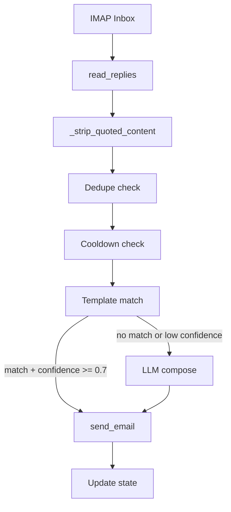

# Jarvey Architecture

Jarvey is the Master Branch Coordinator and Human-in-the-Loop Manager for OutOfRouteBuddy. This document describes the architecture, data flow, and how to extend it.

**Workflow grading:** See [WORKFLOW_SCORING_CHART.md](WORKFLOW_SCORING_CHART.md) for a scoring framework to grade each pipeline stage and overall workflow.

## Flow Diagram



## Components

| Component | Path | Role |
|-----------|------|------|
| Coordinator listener | `scripts/coordinator-email/coordinator_listener.py` | Main loop: poll inbox, decide template vs LLM, send |
| Template registry | `scripts/coordinator-email/template_registry.py` | Load templates from JSON, match keywords, resolve placeholders |
| Check and respond | `scripts/coordinator-email/check_and_respond.py` | Standalone script for scheduled/cron replies |
| Context loader | `scripts/coordinator-email/context_loader.py` | Intent-aware context for LLM (project index, SSOT, on-demand snippets) |
| Config schema | `scripts/coordinator-email/config_schema.py` | Validate .env at startup |
| Health check | `scripts/coordinator-email/health_check.py` | Test IMAP/SMTP/LLM connectivity |
| Retry utils | `scripts/coordinator-email/retry_utils.py` | Exponential backoff for IMAP/SMTP |
| Handlers | `scripts/coordinator-email/handlers.py` | Handler protocol for pluggable response logic |

## Adding a Template

1. Create `scripts/coordinator-email/templates/<key>.json`:

```json
{
  "key": "my_template",
  "priority": 70,
  "keywords": ["keyword1", "keyword2"],
  "keywords_combine": "any",
  "subject": "Re: OutOfRouteBuddy — my topic",
  "body": "Hi,\n\n{{fetcher_name}}\n\n— Jarvey",
  "fetcher": "roadmap",
  "fetcher_fallback": "Fallback text if fetcher fails."
}
```

2. Supported fetchers: `roadmap`, `version`, `timeline`. Add new fetchers in `template_registry.py` `_register_fetchers()`.

3. Add the template key to `_TEMPLATE_SEND_KEYS` in `coordinator_listener.py` if it should use the template path (not LLM).

## Adding an Intent

1. Edit `scripts/coordinator-email/intents/intents.json`:

```json
{
  "name": "my_intent",
  "keywords": ["keyword1", "keyword2"],
  "sources": [["docs/path/to/file.md", 1200]]
}
```

2. Special sources: `version`, `project_timeline`, `recommend` (external fetchers).

3. Call `context_loader.reload_intents()` to hot-reload (dev only).

## Adding a Handler

1. Implement the `Handler` protocol in `handlers.py`:

```python
from handlers import Handler, register_handler

class MyHandler:
    @property
    def name(self) -> str:
        return "my_handler"

    def match(self, subject: str, body: str) -> float:
        return 0.9 if "my trigger" in (subject + body).lower() else 0.0

    def respond(self, subject: str, body: str, **kwargs) -> tuple[str, str]:
        return "Re: OutOfRouteBuddy", "My reply body."
```

2. Register before the listener runs:

```python
from handlers import register_handler
register_handler(MyHandler)
```

## Environment Variables

| Variable | Default | Description |
|----------|---------|-------------|
| COORDINATOR_EMAIL_TO | — | Recipient email |
| COORDINATOR_EMAIL_FROM | — | Sender email |
| COORDINATOR_SMTP_HOST | — | SMTP host |
| COORDINATOR_SMTP_PORT | 587 | SMTP port |
| COORDINATOR_SMTP_USER | — | SMTP username |
| COORDINATOR_SMTP_PASSWORD | — | SMTP app password |
| COORDINATOR_IMAP_* | fallback to SMTP | IMAP credentials |
| COORDINATOR_LISTENER_OPENAI_API_KEY | — | OpenAI API key |
| COORDINATOR_LISTENER_OLLAMA_URL | http://localhost:11434 | Ollama URL |
| ANTHROPIC_API_KEY | — | Anthropic API key |
| COORDINATOR_LISTENER_INTERVAL_MINUTES | 3 | Poll interval |
| JARVEY_TEMPLATE_CONFIDENCE_THRESHOLD | 0.7 | Min confidence for template (else LLM) |
| JARVEY_MAX_RETRIES | 3 | Retries for IMAP/SMTP |
| JARVEY_RETRY_DELAY | 2 | Base delay (sec) for retry backoff |
| JARVEY_STRUCTURED_LOG | 0 | 1 = JSON logs to jarvey_workflow.log |
