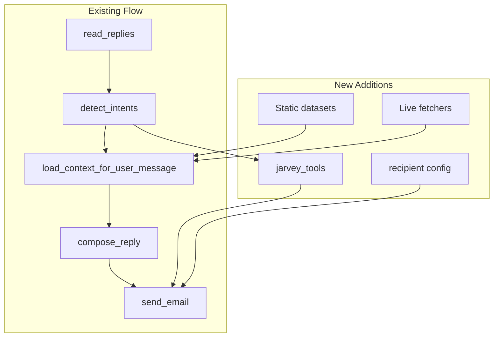

# Jarvey Data & Autonomy Plan

## Current State

Jarvey uses [context_loader.py](../../scripts/coordinator-email/context_loader.py) to load:

- **Base:** coordinator-project-context, project index, condensed SSOT
- **On-demand (intent):** 15 intents (roadmap, recovery, version, recent, etc.) → file snippets, `_get_app_version()`, `get_project_timeline()`, git log

No external APIs, no alternate recipients, no video/content lookup. Jarvey asks for clarification when it lacks context.

---

## Architecture (Additive, Non-Breaking)

---

## 1. Static Datasets (Reduce Clarification)

**Purpose:** Pre-load curated knowledge so Jarvey answers instead of asking.

| Dataset                     | Source                             | Integration                           | Purpose                                                                                |
| --------------------------- | ---------------------------------- | ------------------------------------- | -------------------------------------------------------------------------------------- |
| **Project FAQ**             | Create from existing docs          | `docs/agents/data-sets/JARVEY_FAQ.md` | Common Q&A (recent updates, what's next, recovery, etc.)                               |
| **Clarification overrides** | Create                             | Add to prompt or context              | Map vague phrases → concrete answers (e.g. "recent changes" → always include timeline) |
| **Domain glossary**         | Extract from KNOWN_TRUTHS, ROADMAP | `docs/agents/JARVEY_GLOSSARY.md`      | OOR, loaded miles, bounce, trip store, etc.                                            |

**Implementation:**

- Add `"faq"` intent to INTENT_CONFIG (keywords: "how does", "what is", "explain", "clarify") → load JARVEY_FAQ.md
- Add JARVEY_FAQ.md with 20–30 Q&A pairs distilled from coordinator-project-context, KNOWN_TRUTHS, ROADMAP
- Optionally: add `"glossary"` intent or include glossary in base context (cap ~400 chars)

**No scraping required** for static—we create these from existing project docs.

---

## 2. Live Fetchers (On-Demand)

**Purpose:** Fetch external data when user asks for videos, tutorials, or real-time info.

| Fetcher                   | Trigger                                            | Data                   | API/Source                                        |
| ------------------------- | -------------------------------------------------- | ---------------------- | ------------------------------------------------- |
| **Video/tutorial search** | "recommend video", "tutorial for", "learn about X" | YouTube search results | YouTube Data API v3 (requires API key)            |
| **Web search fallback**   | "find resources", "search for"                     | Top 3–5 snippets       | SerpAPI, Brave Search API, or DuckDuckGo (no key) |

**Implementation:**

- New module: `scripts/coordinator-email/jarvey_fetchers.py`
  - `fetch_youtube_recommendations(query: str, max_results: int = 5) -> str` — returns formatted titles + URLs
  - `fetch_web_search(query: str, max_results: int = 3) -> str` — returns snippets (optional, if API available)
- Add intent `"recommend"` with keywords: "recommend", "video", "tutorial", "learn", "resource"
- In INTENT_CONFIG, add source type `"youtube"` or `"web_search"` — context_loader calls fetcher when intent matches
- Env: `COORDINATOR_YOUTUBE_API_KEY` (optional; if unset, skip YouTube and use cached/static fallback)

**Scraping note:** We use official APIs (YouTube, search) rather than raw scraping to avoid ToS issues and rate limits.

---

## 3. New Actions (Hybrid Control)

### 3a. Create New Emails (Different Subject)

**Current:** Jarvey always replies with `Re: <original subject>`.

**New:** When user says "send me a new email about X" or "create an email with subject Y":

- Compose body as usual
- Use user-specified or inferred subject (e.g. "Recent Updates to OutOfRouteBuddy")
- Send to COORDINATOR_EMAIL_TO (default)

**Implementation:**

- Prompt addition: "When the user asks for 'a new email' or 'send me an email about X', use a fitting subject (e.g. 'Recent Updates to OutOfRouteBuddy') and compose the body. Your reply IS that email."
- `send_email.send()` already accepts subject/body—no code change for send. The LLM composes the subject; we pass it through.
- Minor: ensure coordinator_listener uses LLM-composed subject when user requested "new email" (could add a template or let LLM output subject + body).

### 3b. Send to Coworker / Family

**New:** Configurable recipient aliases. User says "send this to my coworker" or "email my family about X".

**Implementation:**

- `.env` additions:
  - `COORDINATOR_EMAIL_COWORKER=email@example.com`
  - `COORDINATOR_EMAIL_FAMILY=family@example.com` (or comma-separated for multiple)
- New intent `"send_to"` with keywords: "send to coworker", "email family", "forward to"
- `send_email.send(to_addr, subject, body)` — today it uses COORDINATOR_EMAIL_TO. We need an overload or param: `send(subject, body, to_addr=None)`.
- [send_email.py](../../scripts/coordinator-email/send_email.py): Add optional `to_addr` param; if provided, use it; else use COORDINATOR_EMAIL_TO.
- Prompt: "When the user asks to send to coworker or family, use the configured address. You can only send to configured recipients (COORDINATOR_EMAIL_TO, COORDINATOR_EMAIL_COWORKER, COORDINATOR_EMAIL_FAMILY)."
- Tool layer: Before compose, detect "send to X" → resolve recipient from env → pass to send. The LLM composes the body; we inject "Recipient: coworker (email@example.com)" into context when intent matches.

### 3c. Fetch & Recommend Videos/Content

**Implementation:** Covered in §2 (Live Fetchers). When intent `"recommend"` matches, load YouTube/search results into context. LLM includes 2–3 links in the reply.

---

## 4. Datasets to Add (Concrete)

| File                                      | Content                                            | Chars |
| ----------------------------------------- | -------------------------------------------------- | ----- |
| `docs/agents/data-sets/JARVEY_FAQ.md`     | 25–30 Q&A from project docs                        | ~2000 |
| `docs/agents/JARVEY_GLOSSARY.md`          | 15–20 terms (OOR, loaded miles, trip store, etc.)  | ~500  |
| `docs/agents/JARVEY_RECIPIENT_ALIASES.md` | Doc explaining coworker/family config (for prompt) | ~300  |

**External datasets (optional, later):**

- Hugging Face: OpenAssistant-style Q&A for "how to respond to X" — low priority; our FAQ is project-specific.
- Enron dataset: Not useful for reply content; useful only for training models, not RAG.

---

## 5. File Changes Summary

| File                                                | Change                                                                                |
| --------------------------------------------------- | ------------------------------------------------------------------------------------- |
| `docs/agents/data-sets/JARVEY_FAQ.md`               | Create (new)                                                                          |
| `docs/agents/JARVEY_GLOSSARY.md`                    | Create (new)                                                                          |
| `scripts/coordinator-email/context_loader.py`       | Add intents: faq, recommend, send_to; add fetcher calls for youtube/web               |
| `scripts/coordinator-email/jarvey_fetchers.py`      | Create (new) — YouTube, optional web search                                           |
| `scripts/coordinator-email/send_email.py`           | Add `to_addr` param; support alternate recipients                                     |
| `scripts/coordinator-email/coordinator_listener.py` | Resolve recipient from intent; pass to send; prompt updates for new email + send_to   |
| `.env.example`                                      | Add COORDINATOR_EMAIL_COWORKER, COORDINATOR_EMAIL_FAMILY, COORDINATOR_YOUTUBE_API_KEY |
| `docs/agents/JARVEY_DATA_AND_AUTONOMY_PLAN.md`      | Create (new) — this plan as living doc                                                |

---

## 6. Flow Preservation

- **No change** to read_replies, dedupe, cooldown, template path.
- **Additive** intents: new intents only add context when keywords match.
- **Optional** fetchers: if YouTube API key missing, recommend intent still works (LLM suggests "search YouTube for X" as text).
- **Prompt bloat:** Keep new instructions under ~300 chars; use intent-based context loading to avoid loading everything.

---

## 7. Phased Rollout

**Phase 1 (low risk):** Static FAQ + glossary + "create new email" prompt tweak. No new deps.

**Phase 2:** Recipient aliases + send_email `to_addr`. Requires .env config.

**Phase 3:** YouTube fetcher + recommend intent. Requires API key.
