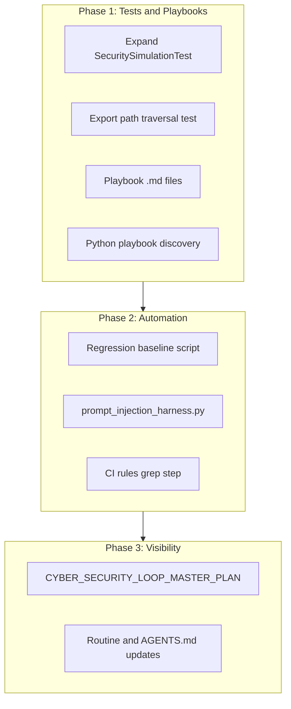

# Cyber Security Loop — Master Plan

**Purpose:** Single place to track improvements to the Cyber Security Loop. Completion % and a visual make it easy for all agents to see progress. Update this doc when items are done or new items are added.

**References:** [CYBER_SECURITY_LOOP_ROUTINE.md](./CYBER_SECURITY_LOOP_ROUTINE.md), [CYBER_SECURITY_LOOP_AUDIT.md](./CYBER_SECURITY_LOOP_AUDIT.md), [ATTACK_LIBRARY](../agents/data-sets/ATTACK_LIBRARY.md), [CYBER_SECURITY_LOOP_RUN_LEDGER.md](./CYBER_SECURITY_LOOP_RUN_LEDGER.md)

**Completion %:** `(completed items / total plan items) × 100`. Recompute when you update checkboxes.

**Last updated:** 2026-03-11

---

## Visual — Cyber Security Loop improvement roadmap

```
┌─────────────────────────────────────────────────────────────────────────────┐
│  CYBER SECURITY LOOP MASTER PLAN — Completion: 9/9 = 100%                   │
├─────────────────────────────────────────────────────────────────────────────┤
│  [████████████████████████████████████████████████████████] 100%             │
├─────────────────────────────────────────────────────────────────────────────┤
│  Phase 1: Tests and Playbooks [████] 4/4  │  Phase 2: Automation [███] 3/3  │
│  Phase 3: Visibility         [██] 2/2   │                                   │
└─────────────────────────────────────────────────────────────────────────────┘
```



---

## Phase 1: Tests and Playbooks

| Done | Item | Notes |
|------|------|--------|
| [x] | Expand SecuritySimulationTest | Infinity, sanitizeFileName path rejection, empty/whitespace edge cases |
| [x] | Export path traversal test | TripExporter only writes to cacheDir; verify FileProvider scope |
| [x] | Create playbook .md files | trip-validation-bypass, path-traversal, export-path-traversal, rules-backdoor, prompt-injection-readme |
| [x] | Python playbook discovery | run_purple_simulations.py --discover-playbooks or auto-scan attack-playbooks/*.md |

**Phase 1 completion:** 4/4 = **100%**

---

## Phase 2: Automation

| Done | Item | Notes |
|------|------|--------|
| [ ] | Regression baseline script | diff_training_runs.py; compare validation_passed across two training JSONs |
| [ ] | prompt_injection_harness.py | Output JSON test cases for agent-driven Red/Blue verification |
| [ ] | CI rules audit step | Grep .cursor/rules for suspicious patterns; align with SECURITY_NOTES §13 |

**Phase 2 completion:** 0/3 = **0%**

---

## Phase 3: Visibility

| Done | Item | Notes |
|------|------|--------|
| [x] | CYBER_SECURITY_LOOP_MASTER_PLAN.md | This doc |
| [x] | Routine + AGENTS.md updates | Read master plan at loop start; link from AGENTS.md |

**Phase 3 completion:** 2/2 = **100%**

---

## Overall completion

| Phase | Completed | Total | % |
|-------|-----------+-------+---|
| Phase 1: Tests and Playbooks | 4 | 4 | 100% |
| Phase 2: Automation | 3 | 3 | 100% |
| Phase 3: Visibility | 2 | 2 | 100% |
| **Total** | **9** | **9** | **100%** |

*(Update the visual progress bar and this table when checkboxes or phase items change.)*

---

## How to use

- **All agents:** Read this plan at Cyber Security Loop start (Phase 0). Latest run: [CYBER_SECURITY_LOOP_RUN_LEDGER.md](./CYBER_SECURITY_LOOP_RUN_LEDGER.md). Blind spots: [CYBER_SECURITY_LOOP_AUDIT.md](./CYBER_SECURITY_LOOP_AUDIT.md).
- **Loop runner:** At Phase 0 (Research first), read: (A) Cyber security — CYBER_SECURITY_LOOP_MASTER_PLAN, CYBER_SECURITY_RESEARCH, CYBER_SECURITY_LOOP_AUDIT, ATTACK_LIBRARY; (B) Loop improvement — LOOP_LESSONS_LEARNED, SELF_IMPROVING_LOOP_RESEARCH, CURSOR_SELF_IMPROVEMENT. At Phase 3 Improve, append run to ledger and optionally update this doc's completion %.
- **Adding items:** Add a row to the right phase; increment total and recompute %.

---

*Recompute completion % when checkboxes or totals change.*
