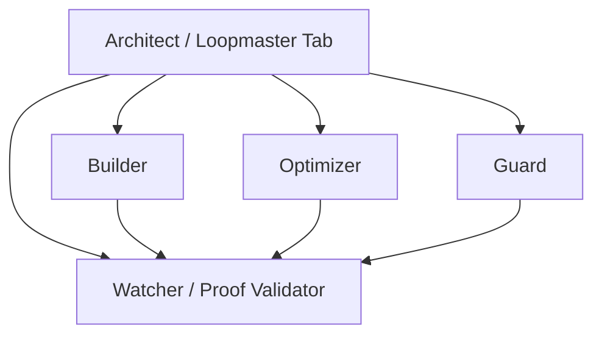

# Loopmaster tab and spawn model

**Purpose:** Define the default neighboring-tab layout and spawned-agent behavior for `Loopmaster` so parallel work stays coordinated instead of redundant.

**Related:** `LOOPMASTER_SUPER_LOOP_BLUEPRINT.md`, `LOOP_MASTER_ROLE.md`, `LOOP_ROLE_CUBE.md`, `LOOP_GATES.md`, `LOOP_HEALTH_CHECKS.md`.

---

## Core idea

Use one parent tab as the conductor and treat the others as scoped workers, not separate loop systems.

`Loopmaster` remains the only real loop contract.

The tab layout is an operating pattern for how work is distributed, not a reason to invent multiple loop species.

---

## Default topology

---

## Why this shape works

- `ArchitectTab` keeps one authority for scope, gates, and final decisions.
- `Builder`, `Optimizer`, and `Guard` can work in parallel on distinct scopes.
- `Watcher` stays independent from implementation ownership, which makes proof validation more honest.
- The model scales naturally to neighboring tabs without changing the core loop contract.

For the sandboxed council pattern, add `DesignJudgeTab` plus a final `LoopCouncil` fan-in stage. See [LOOP_COUNCIL_SANDBOX.md](./LOOP_COUNCIL_SANDBOX.md). This remains design-only for now.

---

## Role boundaries

### Architect / Loopmaster tab

Owns:

- mission and scope
- gate decisions
- file ownership assignment
- keep / partial keep / revert recommendation
- final merge of worker conclusions

This tab may spawn workers, but it should not dump responsibility onto them.

### Builder

Owns:

- concrete implementation slices
- code changes
- targeted tests
- low-risk execution tasks

### Optimizer

Owns:

- self-improvement opportunities
- app-improvement opportunities
- cleanup and efficiency ideas
- optional design-sharpening coordination when a device is connected

### Guard

Owns:

- security review
- regression suspicion
- risky drift detection
- unsafe assumption checks

`Guard` is a defender, not a routine style reviewer.

### Watcher

Owns:

- proof-of-work validation
- claim-to-evidence matching
- residual-risk callouts
- pass / fail / needs-more-proof judgments

`Watcher` should normally remain readonly and independent.

### DesignJudgeTab

Owns:

- screenshot evidence review
- beautification and layout notes
- intelligent placement judgments
- pleasantness and flow scoring using real evidence

`DesignJudgeTab` should not become a second builder. It reviews visual proof and returns that proof to the parent.

---

## Spawn behavior

Use a `fan-out -> work -> fan-in` rhythm.

### Fan-out

`ArchitectTab` may spawn:

- `Builder`
- `Optimizer`
- `Guard`
- `Watcher`

Spawn workers in parallel only when their scopes are clearly partitioned.

### Work

Workers may spawn narrow helper agents for tightly scoped tasks such as:

- running tests
- lint triage
- hotspot search
- screenshot review
- proof tightening

Child workers should not invent new loop structure while doing narrow tasks.

### Fan-in

All worker output returns to `ArchitectTab`.

`ArchitectTab` compares:

- what was claimed
- what was changed
- what was proven
- what still looks risky

Then `ArchitectTab` makes the final recommendation.

In the council sandbox, `ArchitectTab` may normalize all lane output into a `LoopCouncil` scorecard before the final keep/partial-keep/document-only recommendation is issued. `LoopCouncil` remains a judgment stage, not an implementation owner.

---

## Guardrails

### One parent authority per run

Only `ArchitectTab` decides final direction and final keep/revert posture.

### One writer per file family

Do not let multiple workers edit the same file family at once.

Examples:

- one worker owns `docs/automation/*` updates
- one worker owns a Kotlin package slice
- one worker owns a single UI surface

This reduces merge drift and accidental contradiction.

### Watcher defaults to readonly

`Watcher` should validate, not lead implementation.

If `Watcher` finds a proof gap, it should report the gap first. The parent can then re-task a writer if needed.

### Guard is not a bottleneck

Use `Guard` for:

- security-sensitive review
- regression-sensitive review
- suspicious-risk review

Do not force `Guard` to approve every tiny cleanup or wording tweak.

### Design sharpening stays subordinate

If a device is connected, design sharpening can run:

- under `Optimizer`, or
- as a narrow review helper

It should not become a separate loop identity with its own competing authority.

If the council sandbox is enabled later, `DesignJudgeTab` still remains subordinate to `ArchitectTab` and must not auto-ship frontend changes.

---

## Practical operating rhythm

1. `ArchitectTab` defines the mission, constraints, and file ownership map.
2. `Builder`, `Optimizer`, and `Guard` work in parallel on partitioned scopes.
3. `Watcher` validates evidence and reports residual risk.
4. `ArchitectTab` merges conclusions and decides keep, partial keep, or revert recommendation.

---

## Mapping to the role cube

- `ArchitectTab` aligns with `Loop Master` plus `Loop Architect`
- `Builder` aligns with execution lanes
- `Optimizer` aligns with improvement and optional design-sharpening help
- `Guard` aligns with `Loop Health Manager` and `Loop Diagnostic Sweeper` when risk-focused
- `Watcher` aligns most strongly with `Loop Quality Proof` and secondarily with `Loop Consistency Auditor`
- `DesignJudgeTab` aligns most strongly with screenshot review and pleasantness/flow evidence gathering under the existing UX standards

This means the tab pattern fits the existing cube instead of replacing it.

---

## Better than the original sketch

The original sketch was already strong because it separated building, improving, and defending.

The key improvement is making `Watcher` independent instead of downstream from a single worker branch.

That gives you:

- cleaner proof validation
- less bias in quality calls
- easier scale-up across neighboring tabs
