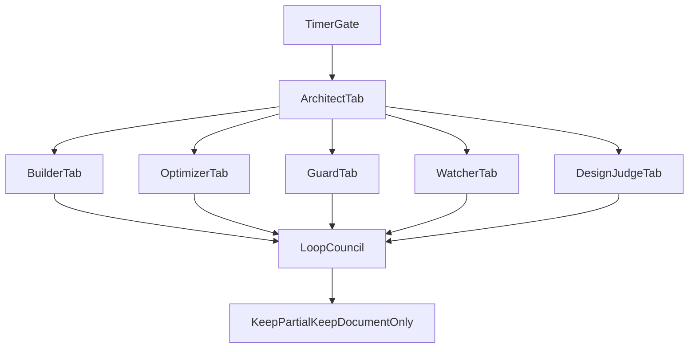

# Loop Council Sandbox

**Purpose:** Define a Heavy-tier sandbox architecture for a timed six-instance `Loopmaster` run that ends in a hybrid-evidence `Loop Council` judgment.

**Status:** Sandbox/design only. This document does **not** approve or implement a live six-instance scheduler. It prebuilds the architecture so a later scaffold or runner can plug into one stable contract.

**Tier:** Heavy. The council model touches orchestration shape, timer semantics, and device-aware judging. It must remain approval-gated and sandboxed until a later execution phase is explicitly approved.

**Related:** `LOOPMASTER_SUPER_LOOP_BLUEPRINT.md`, `LOOPMASTER_TAB_AND_SPAWN_MODEL.md`, `LOOP_GATES.md`, `LOOP_HEALTH_CHECKS.md`, `QUALITY_STANDARDS_AND_PROOF.md`, `docs/ux/SCREENSHOT_REVIEW_WORKFLOW.md`, `docs/ux/PLEASANTNESS_AND_FLOW_STANDARD.md`, `FRONTEND_CHANGE_AUTOMATION_GATE.md`.

---

## Core idea

Treat `Loop Council` as a **fan-in judgment stage**, not as an extra writer lane.

The six timed instances are scoped replicas under one `Loopmaster` authority:

1. `ArchitectTab`
2. `BuilderTab`
3. `OptimizerTab`
4. `GuardTab`
5. `WatcherTab`
6. `DesignJudgeTab`

After those lanes report, `Loop Council` compares the evidence and recommends:

- `keep`
- `partial_keep`
- `document_only`
- `needs_human_visual_approval`

This keeps authority centralized while still allowing multiple perspectives on the same candidate app state.

---

## Heavy classification

This architecture is Heavy because it combines:

- timed multi-instance orchestration
- shared-state and timer semantics
- visual judging against app surfaces
- durability and engineering judgment
- real-device evidence rules

**First-phase rule:** design only. No live six-instance scheduler, no autonomous multi-writer run, and no automatic frontend shipping.

---

## Six-instance topology



### Lane roles

- `ArchitectTab`
  - owns timer cycle, lane assignment, scope, and final keep posture
- `BuilderTab`
  - owns approved implementation slices and targeted verification
- `OptimizerTab`
  - owns cleanup, performance, simplification, and app-improvement opportunities
- `GuardTab`
  - owns regression suspicion, risky drift, and security-focused review
- `WatcherTab`
  - stays readonly and validates claim-to-evidence quality
- `DesignJudgeTab`
  - reviews screenshots, layout, beautification, intelligent placement, and flow clarity when real device evidence exists

### One-writer rule

Only one writer may own a file family in a cycle.

Examples:

- one lane owns `docs/automation/*`
- one lane owns a Kotlin package slice
- `DesignJudgeTab` does not auto-edit UI files by default
- `WatcherTab` remains readonly

---

## Timer sandbox contract

The timer contract is defined now but not automated yet.

### Cycle model

- one `cycle_id` per timed council round
- max six active instances
- one parent authority: `ArchitectTab`
- one scoped assignment per instance
- one shared council-entry gate before fan-in

### Suggested cycle states

- `scheduled`
- `starting`
- `running`
- `complete`
- `timed_out`
- `blocked`
- `proof_gap`
- `council_ready`
- `decided`

### Council entry rule

`Loop Council` starts only when every lane has reported one of:

- `complete`
- `timed_out`
- `blocked`
- `proof_gap`

This prevents premature judgment while still allowing a cycle to end safely if one lane stalls.

### Timeout model

Document these fields even before real scheduling exists:

- `start_ts`
- `heartbeat_ts`
- `timeout_ts`
- `lane_status`
- `owner`
- `artifact_paths`
- `residual_risk`

---

## Hybrid evidence model

The council judges using two evidence classes.

### 1. Visual/design evidence

- screenshots from a connected device or emulator
- before/after pairs when available
- light/dark comparisons when relevant
- `SCREENSHOT_REVIEW_WORKFLOW.md`
- `PLEASANTNESS_AND_FLOW_STANDARD.md`

### 2. Durability/engineering evidence

- unit tests
- lint
- readiness notes
- health checks
- crash/regression suspicion
- touched-file scope
- proof-of-quality and residual risk notes

The council must use:

`claim -> evidence -> residual risk -> next step`

It must not judge only by taste or by green tests alone.

---

## Device-aware design lane

Enable `DesignJudgeTab` only when device evidence is real:

- `adb devices` shows a usable device or emulator
- screenshot capture is possible
- the run scope actually touches or reviews a UI surface
- no unwarranted structural UI change is made automatically

If no device is available:

- mark visual evidence as `partial`
- do not fabricate confidence
- keep `DesignJudgeTab` in review-only or skipped posture

---

## Council scoring contract

Use weighted scores plus a confidence layer.

### Suggested categories

- `beautification_score`
- `layout_flow_score`
- `placement_score`
- `durability_score`
- `evidence_confidence`
- `residual_risk`
- `recommendation`

### Meaning

- `beautification_score`
  - visual polish, calmness, spacing, cohesion
- `layout_flow_score`
  - hierarchy, task flow, and state clarity
- `placement_score`
  - whether controls and emphasis feel intelligently placed
- `durability_score`
  - readiness, regression resistance, and engineering trust
- `evidence_confidence`
  - how complete and trustworthy the proof pack is

### Recommendation values

- `keep`
- `partial_keep`
- `document_only`
- `needs_human_visual_approval`

### Confidence rule

High scores without real evidence should still produce a conservative recommendation.

Examples:

- strong tests but no screenshots -> likely `partial_keep`
- good screenshots but weak durability proof -> likely `document_only`
- strong hybrid proof and low residual risk -> `keep`

---

## Council output blocks

### Markdown summary block

```markdown
## Loop Council Verdict

- Cycle: [cycle_id]
- Version judged: [branch/build/summary path]
- Beautification: X/20
- Layout and flow: X/20
- Placement: X/20
- Durability: X/20
- Evidence confidence: [high | medium | low]
- Strongest signal: [one line]
- Weakest signal: [one line]
- Residual risk: [one line]
- Recommendation: [keep | partial_keep | document_only | needs_human_visual_approval]
```

### JSON shape for a future scaffold

```json
{
  "cycle_id": "council-YYYYMMDD-HHmm",
  "mode": "sandbox",
  "lanes": {
    "architect": "complete",
    "builder": "complete",
    "optimizer": "complete",
    "guard": "proof_gap",
    "watcher": "complete",
    "design_judge": "complete"
  },
  "scores": {
    "beautification_score": 16,
    "layout_flow_score": 15,
    "placement_score": 14,
    "durability_score": 17
  },
  "evidence_confidence": "medium",
  "recommendation": "partial_keep",
  "residual_risk": [
    "Visual proof present, but regression suspicion remains in one flow."
  ]
}
```

---

## Gate and health expectations

The sandbox should align with existing loop controls:

- `LOOP_GATES.md`
  - start gate, publish gate, and a future council-entry gate
- `LOOP_HEALTH_CHECKS.md`
  - heartbeat, timeout, and stalled-lane behavior
- `QUALITY_STANDARDS_AND_PROOF.md`
  - proof-of-quality and traceability

The council does not replace these. It sits **after** them as a judgment layer.

---

## Follow-up scaffold phase

Later execution work may add:

1. placeholder timer/state schema
2. council scorecard templates
3. lane heartbeat files
4. artifact manifests for screenshots, tests, and summaries
5. a real scheduler or orchestrator only after separate approval

---

## Guardrails

- Respect one-writer-per-file-family
- Keep `WatcherTab` readonly
- Do not let `DesignJudgeTab` auto-ship visual changes
- Do not treat missing screenshots as real visual proof
- Do not let the council override frontend approval gates
- Do not silently escalate sandbox scoring into automatic release decisions

---

## Success condition

This sandbox phase succeeds when:

- the six-instance topology is documented
- timer and council-entry semantics are defined
- hybrid judging is grounded in real evidence sources
- the repo has a stable contract for a future scaffold or runner phase without rewriting the design
