```mermaid
flowchart LR
    subgraph P1["Phase 1: Foundation"]
        A1[State snapshot]
        A2[Listener]
        A3[Steps 0-7]
        A4[Next tasks doc]
        A5[Run script]
    end
    subgraph P2["Phase 2: Wiring"]
        B1[Snapshot fix]
        B2[Metrics JSON]
        B3[Rules paths]
        B4[Step 0 reads NEXT_TASKS]
        B5[Events analysis]
    end
    subgraph P3["Agent visibility"]
        C1[Recommendations table]
        C2[Master plan + %]
    end
    subgraph P4["Automation"]
        D1[No-human-in-loop]
        D2[Completion %]
        D3[Visual]
        D4[Agent links]
    end
    subgraph P5["Phase 5: Improvement plan"]
        E1[Read at Step 0]
    end
    subgraph P6["Phase 6: Testing"]
        F1[Snapshot test]
        F2[Listener test]
        F3[Events analysis test]
    end
    subgraph P7["Phase 7: Study and implement"]
        G1[Step 0 read practices]
        G2[Step 7 ledger and practices]
        G3[Step 7 completion %]
    end
    P1 --> P2 --> P3 --> P4
    P4 --> P5 --> P6 --> P7
```

# Token Loop — Master Plan

**Purpose:** Single place to track improvements to the token loop. Completion % and a visual make it easy for all agents to see progress. Update this doc when items are done or new items are added (e.g. from TOKEN_LOOP_NEXT_TASKS.md).

**Improvement plan (blindspots, rule output baseline, context research):** [TOKEN_LOOP_IMPROVEMENT_PLAN.md](./TOKEN_LOOP_IMPROVEMENT_PLAN.md) — read at Step 0; optionally update at Step 7 with "Rule output this run" vs baseline.

**Completion %:** `(completed items / total plan items) × 100`. Recompute when you update checkboxes. **Update at end of each token loop run (Step 7)** when checkboxes or phase items change.

**Last updated:** 2026-03-11 (Phase 2 sync, Phase 6–7 added)

---

## Visual — Token loop improvement roadmap

```
┌─────────────────────────────────────────────────────────────────────────────┐
│  TOKEN LOOP MASTER PLAN — Completion: 21/26 = 81%                            │
├─────────────────────────────────────────────────────────────────────────────┤
│  [████████████████████████████████████████████████░░░░░░░░] 81%             │
├─────────────────────────────────────────────────────────────────────────────┤
│  Phase 1: Foundation        [█████] 5/5   │  Phase 2: Wiring & data [███░░] 3/5 │
│  Phase 3: Agent visibility [█████] 2/2   │  Phase 4: Master plan    [██░░] 2/4 │
│  Phase 5: Improvement plan  [█] 1/1       │  Phase 6: Testing       [██████] 6/6 │
│  Phase 7: Study and implement [██░] 2/3  │                                      │
└─────────────────────────────────────────────────────────────────────────────┘
```



---

## Phase 1: Foundation (scripts, listener, steps, docs)

| Done | Item | Notes |
|------|------|--------|
| [x] | State snapshot at loop start | token_loop_state_snapshot.ps1; rollback + progress tracking |
| [x] | Listener (events 0–7 + start/end) | token_loop_listener.ps1 → token_loop_events.jsonl |
| [x] | Steps 0–7 defined and runnable | Step 0 = research; Step 7 = organize + recommend next tasks |
| [x] | TOKEN_LOOP_NEXT_TASKS.md | Updated at Step 7; read at Step 0 |
| [x] | run_token_loop.ps1 | Snapshot + token_loop_start; prints RunId and steps |

**Phase 1 completion:** 5/5 = **100%**

---

## Phase 2: Wiring & data quality

| Done | Item | Notes |
|------|------|--------|
| [x] | Fix snapshot always_apply_count | Count from rules array (always_apply === true); script derives from deduped rules array |
| [ ] | Fix listener -Metrics JSON in PowerShell | Use single-quoted JSON so metrics parse (not metrics_raw) |
| [x] | Deduplicate .cursor/rules paths | Snapshot dedupes by rule name so same file not double-counted |
| [x] | Step 0 reads TOKEN_LOOP_NEXT_TASKS | Doc says next run reads it; ensure Step 0 instructions include it |
| [ ] | Optional: script to compute completion % from events | e.g. runs with token_loop_end / total runs |

**Phase 2 completion:** 3/5 = **60%**

---

## Phase 3: Agent visibility (token saving recommendations easy to see)

| Done | Item | Notes |
|------|------|--------|
| [x] | Token saving recommendations table | In TOKEN_INITIATIVE_BRIEFING.md §Token saving recommendations; 6 bullets |
| [x] | Link to NEXT_TASKS and Master Plan from briefing | All agents can find latest tasks and plan |

**Phase 3 completion:** 2/2 = **100%**

---

## Phase 4: Master plan & completion tracking

| Done | Item | Notes |
|------|------|--------|
| [x] | TOKEN_LOOP_MASTER_PLAN.md created | This doc |
| [ ] | Completion % formula documented and recomputed each run | % = (completed / total) × 100; update when checkboxes change |
| [x] | Neat visual (ASCII bar + Mermaid) | Progress bar and flowchart above |
| [ ] | Step 7 or Step 0 updates Master Plan completion % | Optional: agent recalculates % and updates this doc at end of run |

**Phase 4 completion:** 2/4 = **50%**

---

## Overall completion

| Phase | Completed | Total | % |
|-------|-----------+-------+---|
| Phase 1: Foundation | 5 | 5 | 100% |
| Phase 2: Wiring & data | 3 | 5 | 60% |
| Phase 3: Agent visibility | 2 | 2 | 100% |
| Phase 4: Master plan | 2 | 4 | 50% |
| Phase 5: Improvement plan | 1 | 1 | 100% |
| Phase 6: Testing | 6 | 6 | 100% |
| Phase 7: Study and implement | 2 | 3 | 67% |
| **Total** | **21** | **26** | **81%** |

*(Update the visual progress bar and this table at Step 7 when checkboxes or phase items change.)*

## Phase 5: Improvement plan (read at Step 0)

| Done | Item | Notes |
|------|------|--------|
| [x] | Read improvement plan (blindspots, rule output, research) at Step 0 | TOKEN_REDUCTION_LOOP Step 0 and [TOKEN_LOOP_IMPROVEMENT_PLAN.md](./TOKEN_LOOP_IMPROVEMENT_PLAN.md) |

---

## Phase 6: Testing

| Done | Item | Notes |
|------|------|--------|
| [x] | Snapshot script test | test_token_loop_snapshot.ps1: output schema, always_apply_count/lines derived from rules array |
| [x] | Listener test (existing) | test_token_loop_listener.ps1; validates JSONL and event types; metrics parsing check added |
| [x] | Events analysis test (optional) | test_token_loop_events_analysis.ps1 validates token_loop_events.jsonl structure and run shape |
| [x] | Wiring test | test_token_loop_wiring.ps1: required docs and scripts exist; TOKEN_REDUCTION_LOOP contains Step 0/7, NEXT_TASKS, token_loop_start/end |
| [x] | Compile (parse) test | test_token_loop_compile.ps1: all token loop PowerShell scripts parse without syntax errors |
| [x] | Test runner | run_token_loop_tests.ps1 runs compile, wiring, listener, snapshot, events analysis; run_token_loop.ps1 -Test runs same |

**Phase 6 completion:** 6/6 = **100%**

---

## Phase 7: Study and implement (newfound skills)

| Done | Item | Notes |
|------|------|--------|
| [x] | At Step 0: read TOKEN_SAVING_PRACTICES and TOKEN_LOOP_IMPROVEMENT_PLAN | TOKEN_REDUCTION_LOOP Step 0 |
| [x] | At Step 7: append TOKEN_LOOP_RUN_LEDGER; update TOKEN_SAVING_PRACTICES §3 (what worked / didn't) | TOKEN_REDUCTION_LOOP Step 7 |
| [ ] | At Step 7 (or Step 0 next run): recompute and update Master Plan completion % | Update this doc's visual bar and Overall completion table when checkboxes change |

**Phase 7 completion:** 2/3 = **67%**

---

## How to use

- **All agents:** Token saving recommendations are in [TOKEN_INITIATIVE_BRIEFING.md](../agents/TOKEN_INITIATIVE_BRIEFING.md) §Token saving recommendations. Latest next-run tasks: [TOKEN_LOOP_NEXT_TASKS.md](./TOKEN_LOOP_NEXT_TASKS.md). This master plan shows what’s done and what’s left.
- **Token loop runner:** At Step 0, read TOKEN_LOOP_NEXT_TASKS, [TOKEN_SAVING_PRACTICES.md](./TOKEN_SAVING_PRACTICES.md), [TOKEN_LOOP_IMPROVEMENT_PLAN.md](./TOKEN_LOOP_IMPROVEMENT_PLAN.md) (blindspots, rule output, research), and this plan. At Step 7: append [TOKEN_LOOP_RUN_LEDGER.md](./TOKEN_LOOP_RUN_LEDGER.md), update TOKEN_SAVING_PRACTICES §3 (what worked / didn't), optionally update TOKEN_LOOP_IMPROVEMENT_PLAN §4 (rule output this run), and **recompute and update this doc's completion %** (visual bar and Overall completion table).
- **Adding items:** Pull from TOKEN_LOOP_NEXT_TASKS or new ideas; add a row to the right phase; increment total and recompute %.

---

*Recompute completion % when checkboxes or totals change.*
