```mermaid
flowchart LR
    subgraph P1["Phase 1: Foundation"]
        A1[State snapshot]
        A2[Listener]
        A3[Steps 0-7]
        A4[Next tasks doc]
        A5[Run script]
    end
    subgraph P2["Phase 2: Wiring"]
        B1[Snapshot fix]
        B2[Metrics JSON]
        B3[Rules paths]
        B4[Step 0 reads NEXT_TASKS]
        B5[Events analysis]
    end
    subgraph P3["Agent visibility"]
        C1[Recommendations table]
        C2[Master plan + %]
    end
    subgraph P4["Automation"]
        D1[No-human-in-loop]
        D2[Completion %]
        D3[Visual]
        D4[Agent links]
    end
    P1 --> P2 --> P3 --> P4
```

# Token Loop — Master Plan

**Purpose:** Single place to track improvements to the token loop. Completion % and a visual make it easy for all agents to see progress. Update this doc when items are done or new items are added (e.g. from TOKEN_LOOP_NEXT_TASKS.md).

**Improvement plan (blindspots, rule output baseline, context research):** [TOKEN_LOOP_IMPROVEMENT_PLAN.md](./TOKEN_LOOP_IMPROVEMENT_PLAN.md) — read at Step 0; optionally update at Step 7 with "Rule output this run" vs baseline.

**Completion %:** `(completed items / total plan items) × 100`. Recompute when you update checkboxes.

**Last updated:** 2026-03-11 (from first full token loop run)

---

## Visual — Token loop improvement roadmap

```
┌─────────────────────────────────────────────────────────────────────────────┐
│  TOKEN LOOP MASTER PLAN — Completion: 10/16 = 63%                           │
├─────────────────────────────────────────────────────────────────────────────┤
│  [████████████████████████████████████░░░░░░░░░░░░░░░░░░░░] 63%             │
├─────────────────────────────────────────────────────────────────────────────┤
│  Phase 1: Foundation        [█████] 5/5   │  Phase 2: Wiring & data [█░░░░] 1/5 │
│  Phase 3: Agent visibility  [█████] 2/2   │  Phase 4: Master plan    [██░░░] 2/4 │
└─────────────────────────────────────────────────────────────────────────────┘
```



---

## Phase 1: Foundation (scripts, listener, steps, docs)

| Done | Item | Notes |
|------|------|--------|
| [x] | State snapshot at loop start | token_loop_state_snapshot.ps1; rollback + progress tracking |
| [x] | Listener (events 0–7 + start/end) | token_loop_listener.ps1 → token_loop_events.jsonl |
| [x] | Steps 0–7 defined and runnable | Step 0 = research; Step 7 = organize + recommend next tasks |
| [x] | TOKEN_LOOP_NEXT_TASKS.md | Updated at Step 7; read at Step 0 |
| [x] | run_token_loop.ps1 | Snapshot + token_loop_start; prints RunId and steps |

**Phase 1 completion:** 5/5 = **100%**

---

## Phase 2: Wiring & data quality

| Done | Item | Notes |
|------|------|--------|
| [ ] | Fix snapshot always_apply_count | Count from rules array (always_apply === true), not regex on full file |
| [ ] | Fix listener -Metrics JSON in PowerShell | Use single-quoted JSON so metrics parse (not metrics_raw) |
| [ ] | Deduplicate .cursor/rules paths | Single path convention so Glob/snapshot don't double-count |
| [x] | Step 0 reads TOKEN_LOOP_NEXT_TASKS | Doc says next run reads it; ensure Step 0 instructions include it |
| [ ] | Optional: script to compute completion % from events | e.g. runs with token_loop_end / total runs |

**Phase 2 completion:** 1/5 = **20%**

---

## Phase 3: Agent visibility (token saving recommendations easy to see)

| Done | Item | Notes |
|------|------|--------|
| [x] | Token saving recommendations table | In TOKEN_INITIATIVE_BRIEFING.md §Token saving recommendations; 6 bullets |
| [x] | Link to NEXT_TASKS and Master Plan from briefing | All agents can find latest tasks and plan |

**Phase 3 completion:** 2/2 = **100%**

---

## Phase 4: Master plan & completion tracking

| Done | Item | Notes |
|------|------|--------|
| [x] | TOKEN_LOOP_MASTER_PLAN.md created | This doc |
| [ ] | Completion % formula documented and recomputed each run | % = (completed / total) × 100; update when checkboxes change |
| [x] | Neat visual (ASCII bar + Mermaid) | Progress bar and flowchart above |
| [ ] | Step 7 or Step 0 updates Master Plan completion % | Optional: agent recalculates % and updates this doc at end of run |

**Phase 4 completion:** 2/4 = **50%**

---

## Overall completion

| Phase | Completed | Total | % |
|-------|-----------+-------+---|
| Phase 1: Foundation | 5 | 5 | 100% |
| Phase 2: Wiring & data | 1 | 5 | 20% |
| Phase 3: Agent visibility | 2 | 2 | 100% |
| Phase 4: Master plan | 2 | 4 | 50% |
| **Total** | **10** | **16** | **63%** |

*(Update the visual progress bar and this table when you add or complete items.)*

## Phase 5: Improvement plan (read at Step 0)

| Done | Item | Notes |
|------|------|--------|
| [x] | Read improvement plan (blindspots, rule output, research) at Step 0 | TOKEN_REDUCTION_LOOP Step 0 and [TOKEN_LOOP_IMPROVEMENT_PLAN.md](./TOKEN_LOOP_IMPROVEMENT_PLAN.md) |

---

## How to use

- **All agents:** Token saving recommendations are in [TOKEN_INITIATIVE_BRIEFING.md](../agents/TOKEN_INITIATIVE_BRIEFING.md) §Token saving recommendations. Latest next-run tasks: [TOKEN_LOOP_NEXT_TASKS.md](./TOKEN_LOOP_NEXT_TASKS.md). This master plan shows what’s done and what’s left.
- **Token loop runner:** At Step 0, read TOKEN_LOOP_NEXT_TASKS, [TOKEN_LOOP_IMPROVEMENT_PLAN.md](./TOKEN_LOOP_IMPROVEMENT_PLAN.md) (blindspots, rule output, research), and this plan. At Step 7, consider adding completed items here and recomputing completion %.
- **Adding items:** Pull from TOKEN_LOOP_NEXT_TASKS or new ideas; add a row to the right phase; increment total and recompute %.

---

*Recompute completion % when checkboxes or totals change.*
